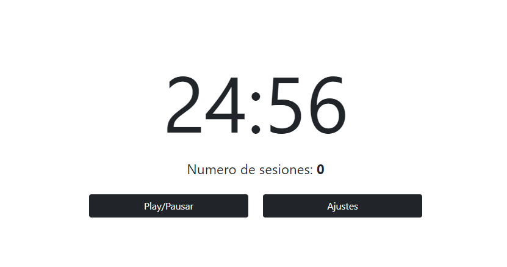

# Pomodoro React App

App de pomodoro, conteo de sesiones y configuracion de duración de las sesiones



---

##### Aplicacion de pomodoro usando react y algunos *hooks*:

- ```useContext```
- ```useState```
- ```useEffect```

---

##### Paquetes usados:

Para el timer se utilizo **react-timer-hook** especifícamente **useTimer**.

[react-timer-hook](https://www.npmjs.com/package/react-timer-hook)

Para el Modal se utilizo **react-bootstrap**.

[react-bootstrap](https://react-bootstrap.github.io/getting-started/introduction/)

